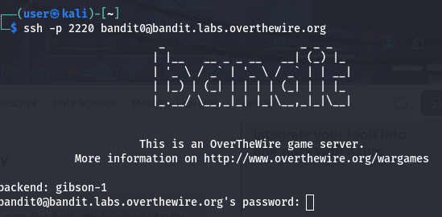

## Level Goal

The goal of this level is for you to log into the game using SSH. The host to which you need to connect is bandit.labs.overthewire.org, on port 2220. The username is bandit0 and the password is bandit0. Once logged in, go to the Level 1 page to find out how to beat Level 1.

## Solution

This one is rather straightforward, and is more of a setup than an actual challenge.

Regardless, after running a simple ssh command, you will be prompted to enter the password.

`ssh -p 2220 bandit0@bandit.labs.overthewire.org`

Follow the isntructions and type in `bandit0` and you will be in!

## What We learned

How to connect to a remote Linux system using SSH.

## References

- [Official Bandit Level 0 page](https://overthewire.org/wargames/bandit/bandit0.html)
- [OverTheWire Rules](https://overthewire.org/rules/)