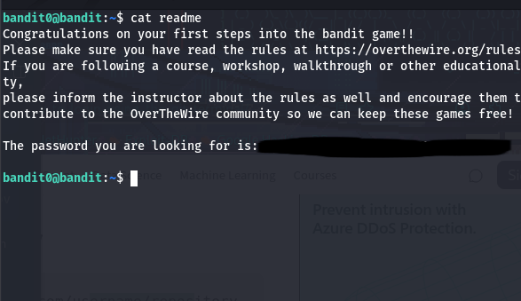

## Level Goal

The password for the next level is stored in a file called readme located in the home directory. Use this password to log into bandit1 using SSH. Whenever you find a password for a level, use SSH (on port 2220) to log into that level and continue the game.

## Solution

Alright, from the previous level, we have logged in.

So, the instructions say the password is in a file called "readme".

Let's use the `cat` cmd to print out the contents of the file:

And we get the password! Now to move on the next levels from now, we should use the `ssh` command jsut like in level 0, to login. So, to get to the next level, we will use `bandit1` to login.

## What We learned

How to read a file with `cat` and use its contents to log into the next level.

## References

- [Official Bandit Level 0 page](https://overthewire.org/wargames/bandit/bandit0.html)
- [OverTheWire Rules](https://overthewire.org/rules/)